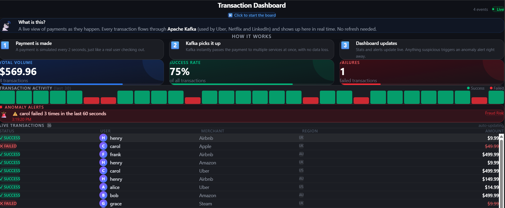

# Real-Time Transaction Dashboard

A live payment monitoring dashboard powered by Apache Kafka, ASP.NET Core, SignalR, and React.



---

## What It Does

Simulates a real-time payment system — the same architecture used by companies like **Uber, Netflix, and LinkedIn** to process millions of events per second.

Every 2 seconds, a payment transaction is generated and flows through the entire pipeline:

1. **Producer** publishes a transaction to a Kafka topic
2. **Three independent consumers** each read the same event simultaneously:
   - One updates the **live transaction feed**
   - One recalculates **running stats** (volume, success rate, failures)
   - One runs **anomaly detection** (flags users with repeated failures)
3. **SignalR** pushes all updates to the browser in real time — no page refresh needed

---

## Tech Stack

| Layer | Technology |
|---|---|
| Message Broker | Apache Kafka (via Redpanda) |
| Backend | ASP.NET Core (.NET 10) |
| Real-time push | SignalR (WebSockets) |
| Frontend | React + Vite + Tailwind CSS |
| Backend hosting | Render (Docker container) |
| Frontend hosting | Vercel |

---

## Architecture

```
React Frontend  ←──── SignalR (WebSocket) ────←  ASP.NET Core Backend
                                                         │
                                              ┌──────────┴──────────┐
                                         Producer            3 Consumers
                                              │                     │
                                              └──────┐   ┌──────────┘
                                                     ↓   ↑
                                               Kafka Topic
                                              "transactions"
```

The key insight: **the producer and consumers are completely decoupled**. The producer doesn't know or care who is consuming. New consumers can be added at any time without touching the producer — this is why Kafka scales so well in production.

---

## Features

- Live transaction feed (last 50 transactions)
- Running stats: total volume, success rate, failure count
- Activity bar showing the last 30 transaction statuses at a glance
- Anomaly detection: alerts when a user has 3+ failures within 60 seconds
- Start / Stop simulation button
- Cold-start aware: shows a loading screen while the free server wakes up (~30s)

---

## Running Locally

**Prerequisites:** Docker, .NET 10, Node.js

```bash
# 1. Start Kafka
docker run -d -p 9092:9092 --name redpanda \
  redpandadata/redpanda:latest \
  redpanda start --overprovisioned --smp 1 --memory 200M \
  --reserve-memory 0M --node-id 0 --check=false

# 2. Start backend
cd backend
dotnet run

# 3. Start frontend
cd frontend
npm install
npm run dev
```

Open `http://localhost:5173` and click **"Click to start the board"**.

---

## Live Demo

[View Live Dashboard](https://kafka-dashboard-frontend.vercel.app)

> The backend runs on a free tier and sleeps after inactivity. First load may take ~30 seconds to wake up.

---

## Why Kafka?

Most APIs handle one request at a time — request in, response out. Kafka flips this model. Events are published to a topic and any number of consumers can independently read them, at their own pace, without blocking each other.

This project demonstrates:
- **Consumer groups** — three separate services (feed, stats, anomaly) each get every event
- **Offset management** — Kafka tracks where each consumer left off; no event is lost
- **Decoupled architecture** — producer and consumers have no direct dependency on each other
- **Real-time delivery** — events reach the browser within milliseconds of being published
